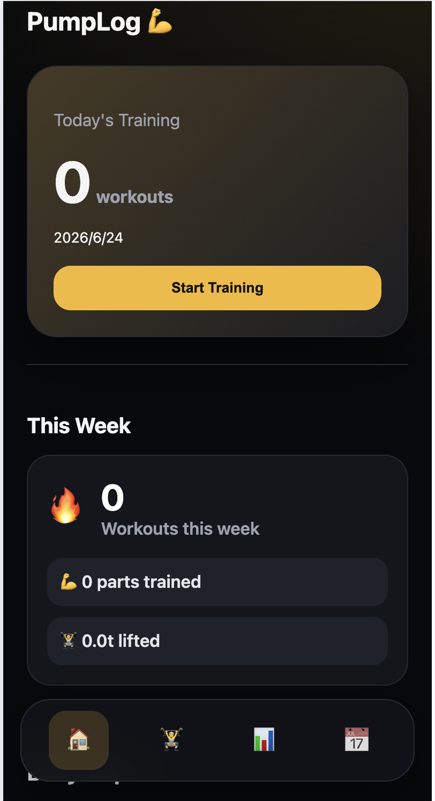
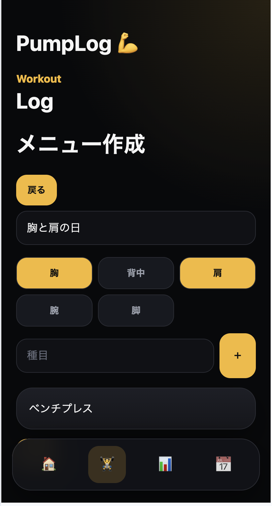
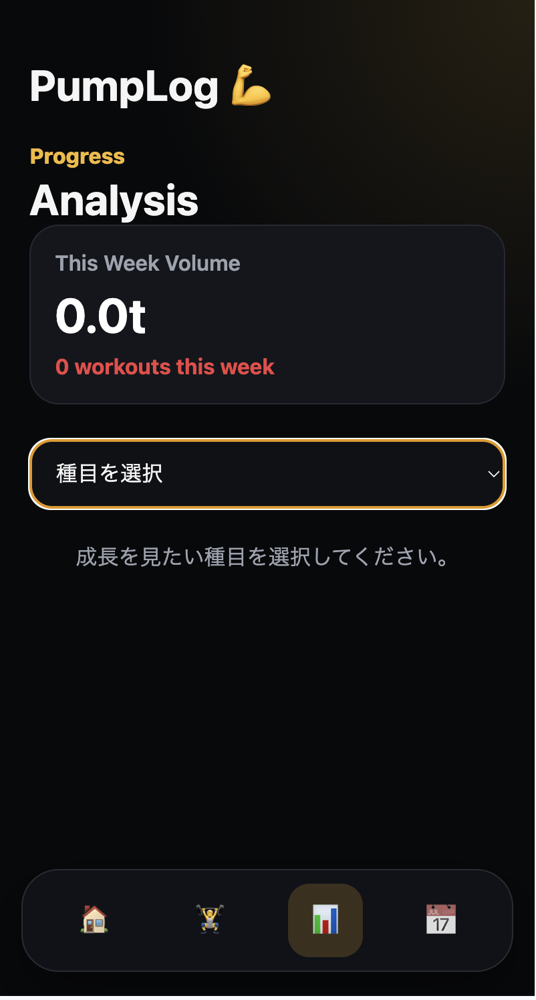

# PumpLog

筋トレの記録と成長を可視化するトレーニング記録アプリです。

## URL
https://pump-log-web.vercel.app/

## 概要

PumpLogは、筋トレの内容をセット単位で記録し、過去のトレーニング履歴や重量の成長を確認できるWebアプリです。

既存の筋トレ記録アプリは「記録すること」が中心になりやすく、成長や継続状況が見えにくいと感じたため、自分が使いやすい形を目指して作成しました。

## 主な機能

- トレーニングメニューの作成
- 種目ごとの重量・回数・セット記録
- 今日のトレーニング表示
- 過去のトレーニング履歴表示
- 種目ごとの成長グラフ
- PR表示
- 鍛えた部位の可視化
- localStorageによるデータ保存

## 使用技術

- React
- TypeScript
- Vite
- CSS
- localStorage
- Vercel

## 工夫した点

### セット単位で記録できる設計

筋トレでは同じ種目でもセットごとに重量や回数が変わるため、1種目につき複数セットを記録できるようにしました。

### 継続状況が見えるホーム画面

今日のトレーニング数、週間トレーニング数、継続日数、PRをホーム画面に表示し、記録するだけでなくモチベーションにつながる画面を意識しました。

### スマホで使いやすいUI

ジムで使用することを想定し、スマホ幅で見やすいレイアウトにしました。下部ナビゲーションを配置し、片手でも画面を切り替えやすい構成にしています。

## 苦労した点

最初は単純に「種目・重量・回数」を保存する形でしたが、実際に使うことを考えるとセットごとの管理が必要だと気づきました。

そのため、データ構造を見直し、トレーニングセッション、種目、セットを分けて管理する形に変更しました。

## 今後追加したい機能

- ログイン機能
- Supabaseなどを使ったデータベース保存
- 複数端末でのデータ同期
- より詳しい分析機能
- 種目ごとの推定1RM表示

## 開発目的

ReactとTypeScriptを使って、実際に自分が使うアプリを作ることを目的に開発しました。

単に画面を作るだけでなく、データの保存、編集、削除、分析表示まで含めて、Webアプリとして一通り動くものを目指しました。